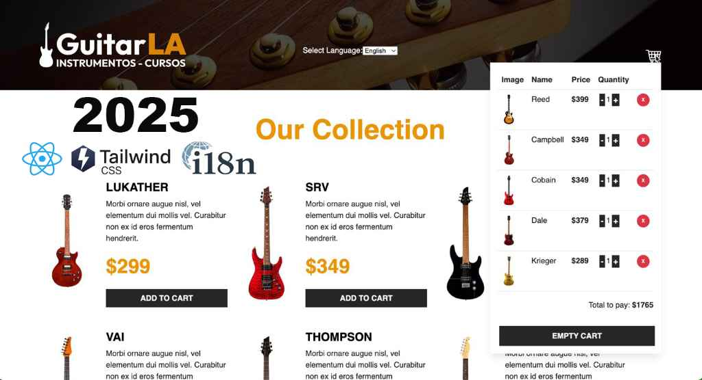

# 🎸 GuitarLA - Your Online Guitar Shop 🎸

Welcome to the GuitarLA repository! This project is a modern online guitar store, designed to offer a fluid and intuitive user experience, built with the latest web technologies.

## 🚀 System Preview - Ready for 2025! 🚀

Here's a sneak peek of our system, highlighting the key technologies that power it:



**GuitarLA** offers a comprehensive catalog of guitars, allowing users to browse different models, view detailed information, check prices, and add items to their shopping cart. The system also includes a shopping cart functionality where users can manage their selected items and see the total cost.

This project emphasizes a clean and responsive design, ensuring a great experience across various devices.

## 🛠️ Built With

This project was built using the following key technologies:

- **React:** A JavaScript library for building user interfaces.
- **Vite:** A build tool that aims to provide a faster and leaner development experience for modern web projects.
- **Tailwind CSS:** A utility-first CSS framework for rapidly styling web applications.
- **i18n (Internationalization):** Enabling the application to be easily translated and support multiple languages (English, French, Spanish).
- **TypeScript:** A statically typed superset of JavaScript that adds optional static typing to the language.

## ✨ Key Features

- **Guitar Catalog:** Browse a variety of guitars with detailed descriptions and prices.
- **Shopping Cart:** Add, remove, and manage items in your cart.
- **Multi-language Support:** View the application in English, French, and Spanish.
- **Responsive Design:** Looks and works great on desktops, tablets, and mobile devices.
- **Modern UI:** Clean and intuitive user interface for a seamless shopping experience.

## ⚙️ Getting Started

To run this project locally, follow these steps:

1.  **Clone the repository:**
    ```bash
    git clone 
    ```
2.  **Navigate to the project directory:**
    \`\`\`bash
    cd 
    \`\`\`
3.  **Install dependencies:**
    \`\`\`bash
    npm install # or yarn install
    \`\`\`
4.  **Start the development server:**
    \`\`\`bash
    npm run dev # or yarn dev
    \`\`\`

    This will start the application in development mode. Open your browser and navigate to the address provided (usually `http://localhost:5173`).


## ✍️ Contributing

Contributions are welcome! If you'd like to contribute to this project, please follow these guidelines:

1.  Fork the repository.
2.  Create a new branch for your feature or bug fix.
3.  Make your changes and commit them.
4.  Push your changes to your fork.
5.  Submit a pull request.

## 📄 License

Free

## 📞 Contact

edgonzalez.mendoza@gmail.com

---

Thank you for checking out GuitarLA! We hope you enjoy the experience.

---
